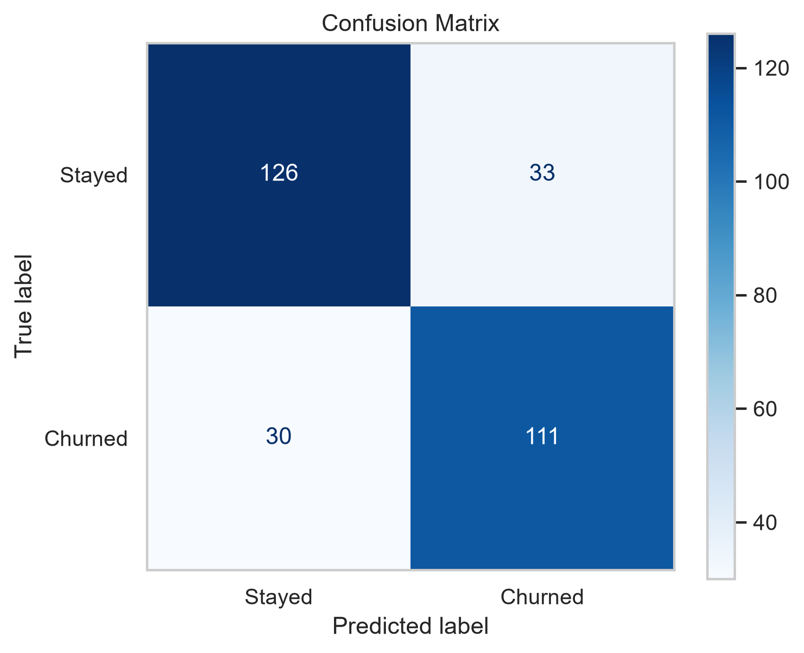
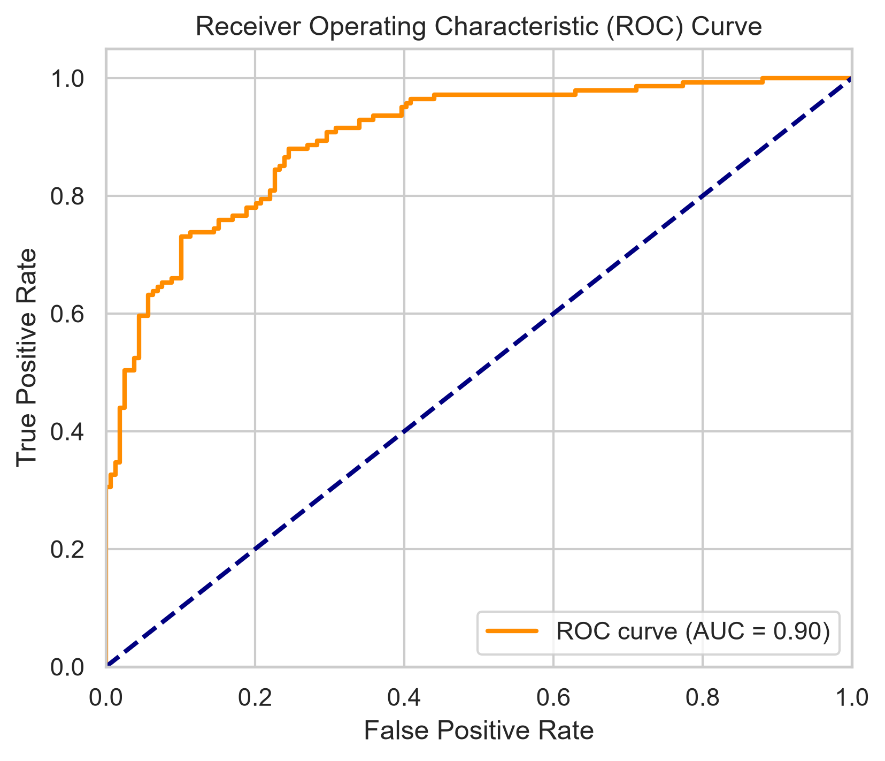
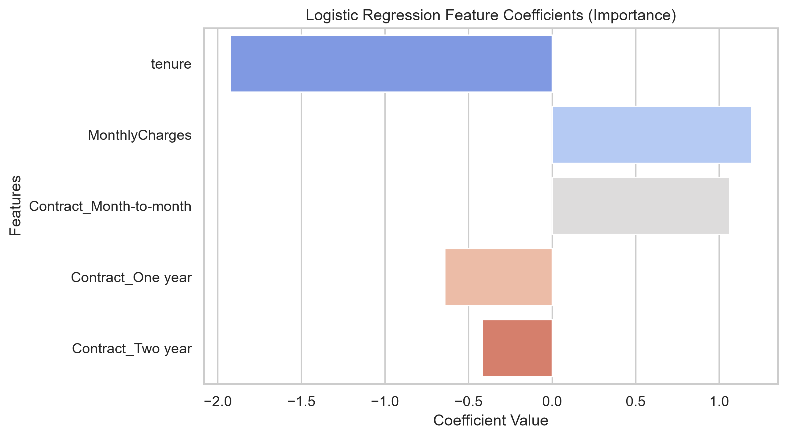

# Customer Churn Prediction Pipeline

This repository contains a Machine Learning pipeline built in Python to predict 
telecom customer churn using **Logistic Regression**. The model achieves **79% accuracy**, 
allowing businesses to proactively target at-risk users with retention strategies.

## Dataset Overview

The project utilizes synthetic customer data modeled after the public Telco Churn 
dataset, capturing key customer attributes:

- **Tenure:** Number of months the customer has stayed with the company.
- **Monthly Charges:** The amount charged to the customer monthly.
- **Contract Type:** Month-to-month, One year, or Two year.
- **Churn (Target):** Whether the customer left the company (1) or stayed (0).

> Note: the dataset is synthetically generated using a logistic model to simulate 
> realistic churn behaviour. No real customer data is used.

## Repository Structure

Customer_Churn_Predictor/
├── churn_model.py        # Standalone pipeline script
├── churn_analysis.ipynb  # EDA + step-by-step notebook
├── requirements.txt
├── README.md
└── images/               # Generated plots (created on first run)

## Tech Stack & Libraries

- **Language:** Python
- **Libraries:** Pandas, NumPy, Scikit-Learn, Seaborn, Matplotlib

## How to Run Locally

```bash
# 1. Clone the repository
git clone https://github.com/GiacomoVenturini1/Customer_Churn_Predictor.git
cd Customer_Churn_Predictor

# 2. Install dependencies
pip install -r requirements.txt

# 3a. Run the standalone script (generates plots to images/)
python churn_model.py

# 3b. Or explore the step-by-step notebook
jupyter notebook churn_analysis.ipynb
```

## Results




